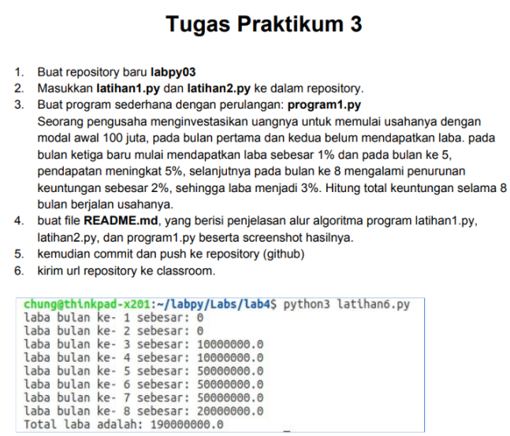
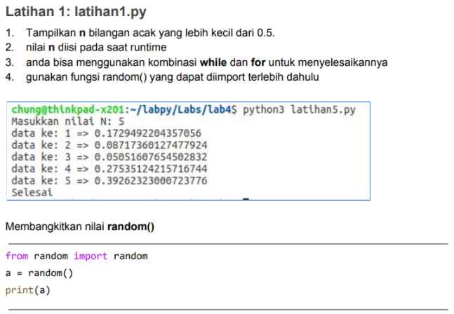
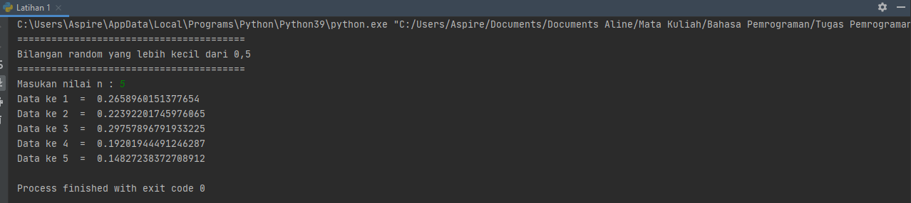
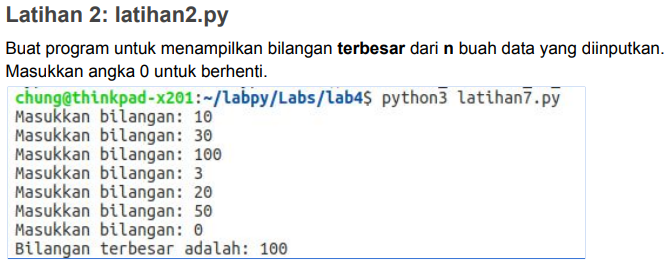

# PERTEMUAN 7
### NAMA: INDIRA ALINE
### KELAS: TI. 20. A. 1
### NIM: 312010042

_________________________________________________________________________________________
## TUGAS PRAKTIKUM 3
Pada pertemuan 7 di PPT3 ini saya diberikan beberapa tugas diantaranya yaitu:

 <br>

_________________________________________________________________________________________
## LATIHAN 1
Untuk saat ini saya akan mencoba untuk mengerjakan Latihan 1 seperti gambar dibawah ini terlebih dahulu.

 <br>

untuk mengerjakannya kalian perlu memasukan sytax berikut 

```python
import random
print(40*"=")
print("Bilangan random yang lebih kecil dari 0,5")
print(40*"=")
jum = int( input("Masukan nilai n : "))
i = 0
for i in range(jum):
    i += 1
    angkaDec = random.uniform(0, 0.5)
    print("Data ke", i, " = ", angkaDec)
```
Maka hasil yang didapat dari syntax tersebut adalah

 <br>

_______________________________________________________________________________________
## LATIHAN 2
Setelahnya saya akan mencoba untuk mengerjakan Latihan selanjutnya yaitu Latihan 2.

 <br>