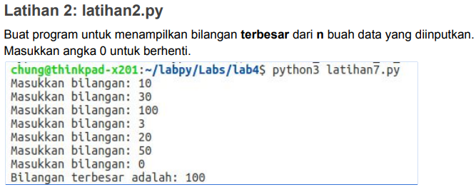
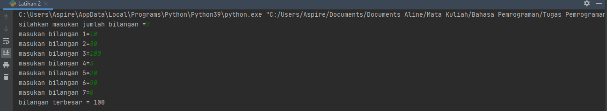
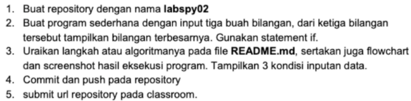
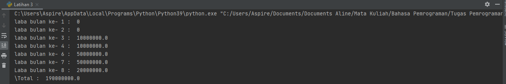

# PERTEMUAN 7
### NAMA: INDIRA ALINE
### KELAS: TI. 20. A. 1
### NIM: 312010042

_________________________________________________________________________________________
## TUGAS PRAKTIKUM 3
Pada pertemuan 7 di PPT3 ini saya diberikan beberapa tugas diantaranya yaitu:

 <br>

_________________________________________________________________________________________
## LATIHAN 1
Untuk saat ini saya akan mencoba untuk mengerjakan Latihan 1 seperti gambar dibawah ini terlebih dahulu.

 <br>

untuk mengerjakannya kalian perlu memasukan sytax berikut 

```python
import random
print(40*"=")
print("Bilangan random yang lebih kecil dari 0,5")
print(40*"=")
jum = int( input("Masukan nilai n : "))
i = 0
for i in range(jum):
    i += 1
    angkaDec = random.uniform(0, 0.5)
    print("Data ke", i, " = ", angkaDec)
```
Maka hasil yang didapat dari syntax tersebut adalah

 <br>

_______________________________________________________________________________________
## LATIHAN 2
Setelahnya saya akan mencoba untuk mengerjakan Latihan selanjutnya yaitu Latihan 2.

 <br>

Untuk mengerjakan soal diatas maka kita perlu memasukan atau menginput datanya terlebih dahulu baru setelah itu bisa terlihat data mana yang terbesar dengan syntax.
```python
N=int(input("silahkan masukan jumlah bilangan ="))
if N>0:
    i=1
    x=int(input("masukan bilangan "+str(i)+"="))
    max=x;total=x
    for i in range(2,N+1):
        x=int (input("masukan bilangan "+str(i)+"="))
        total+=x
        if max<x:
            max=x

    print("bilangan terbesar =",max)
```
Setelah itu bisa langsung kalian run untuk dapat memasukan data yang sesuai dengan yang ada di soal seperti dibawah ini

 <br>

Setelah itu saya ditugaskan untuk membuat,3 Bilangan besar yang satu meiliki bilangan
terbesar untuk lebih jelasnya akan saya jelaskan melalui uraian dibawah ini:

## LATIHAN 3

 <br>

```python
a = 100000000
for x in range (1,9):
    if (x>=1 and x<=2):
        b=a*0
        print("laba bulan ke-",x,": ",b)
    if (x>=3 and x<=4):
        c=a*0.1
        print("laba bulan ke-",x,": ",c)
    if (x>5 and x<=7):
        d=a*0.5
        print ("laba bulan ke-",x,": ",d)
    if (x==8):
        e=a*0.2
        print("Laba bulan ke-",x,": ",e)
total=b+b+c+c+d+d+d+e
print("\Total : ",total)

```

### Penjelasan:

Variabel a = 100.000.000 modal awal

Menggunakan fungsi looping for pada nilai x 1-9 untuk menampilkan bulan 1 sampai bulan 8.

Menggunakan fungsi if, untuk menghitung laba bulan 1 sampai 8

Bulan pertama dan kedua laba adalah 0

Bulan ke 3 dan ke 4 mendapat laba 1% sehingga modal di kali 1% = keuntungan

Bulan ke 5 mendapatkan laba 5%, sehingga modal dikali 5% = keuntungan

Bulan ke 8 mendapatkan laba 2% sehingga keuntungan menurun dari bulan sebelumnya, modal dikali 2% = keuntungan.

Menghitung jumlah total laba dengan menjumlah keuntungan dari bulan ke 1 sampai bulan 8, hasilnya adalah total keuntungan yang didapat total=b+b+c+c+d+d+d+e

print("\Total : ",total), untuk menampilkan hasil keseluruhan laba dari bulan pertama sampai bulan kedelapan.

### Output

 <br>